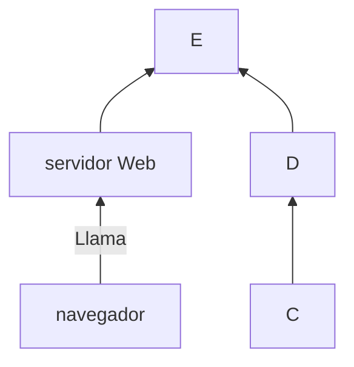

+++
title = 'Markdown'
date = 2024-10-04T13:26:40+02:00
draft = false
weight=20
+++
## Edición básica
### Títulos
Para establecer los títulos usaré la siguiente sintaxis
```
# titulo1
## titulo2
### titulo3
#### titulo4
##### titulo5
###### titulo6
----
```
y se verá
**Texto en negrita** texto normal
# titulo1
## titulo2
### titulo3
#### titulo4
##### titulo5
###### titulo6

----
### Negrita y formato
Para ver el texto en negrita escribo 
```markdown 
**Texto en negrita** texto normal
``` 
y se verá

**Texto en negrita** texto normal

```bash
{{`<>}}
```

 accede a la web 

y se verá

BT es de abajo a arriba y LR de izquierda a derecha (imagino que el resto cambiando letras)


